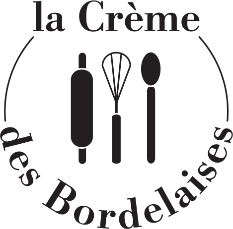

  

 

- [Les colorants](#headers)  
- [La Pâte à sucre](#sucre)  
- [Décoration biscuits](#biscuits)   

# Les colorants <a name="colorants "/>

Deux sortes de colorants s’incorporent dans la masse, c’est-à-dire directement dans la préparation :  
- Les colorants hydrosolubles : 
  ils se dissolvent dans l’eau et conviennent donc à la coloration des pâtes à dominante aqueuse  (gâteaux, entremets, biscuits, pâte d’amande, pâte à sucre, etc.).
- Les colorants liposolubles : 
  on les utilise dans des matières grasses ou huileuses (essentiellement dans le chocolat, les crèmes très riches, le beurre, etc.).

## Les différentes matières 
### Liquide 
Il s’agit des colorants les plus présents dans les grandes surfaces, ce sont souvent les premiers que l’on teste. 

| Les +  |   Les - |
|--------|---------|
| Dosage facile (goutte par goutte) | pigments très dilués
|                                   | modification de la texture de la pâte |
|                                   | goût parfois désagréable |
|                                   | tenue des couleurs limitée à la cuisson |

### Gel
Les colorants en gel sont riches en pigments. Il est donc conseillé de les doser avec un cure-dent ou un bout de couteau, pour plus de finesse. 

| Les +  |   Les - |
|--------|---------|
| pigments concentrés | difficulté à estimer la couleur dans le pot (très foncée) |
| multi-usages | | 
| Incorporation facile, sans humidification de la préparation | |
| Bonne tenue des couleurs (vives et pastels) à la cuisson | |
| Longue conservation | |

### Poudre

Sa pigmentation étant assez intense, il est préférable de la doser minutieusement avec la pointe d’un couteau. Si votre pâte est assez épaisse ou sèche, pensez à diluer le colorant dans une petite quantité d’eau, pour faciliter son incorporation.

| Les +  |   Les - |
|--------|---------|
| Pigments très concentrés | Dosage très minutieux |
| Couleurs intenses et soutenues | A diluer avant l’incorporation dans une pâte sèche |
| Pas d’incorporation d’eau à la recette | |
| Incorporation facile dans les préparations humides | |
| Bonne tenue des couleurs à la cuisson | |
| Très longue conservation | |

## Les  colorants de surfaces 
- Sucre coloré :   
  un grand classique à saupoudrer sur vos desserts. Il s’agit simplement de sucre mélangé à du colorant liposoluble poudre. On utilise le même principe pour colorer de la noix de coco râpée.
- Colorants en poudre :   
  nacrés ou irisés, ils apportent une touche brillante et raffinée à vos desserts. On les applique directement sur la préparation finale, avec le doigt, en saupoudrant délicatement ou au pinceau. On peut également les diluer dans de l’alcool alimentaire pour les pulvériser avec un aérographe.
- Colorant en spray (ou bombe aérosol) :   
  on le pulvérise sur le dessert pour obtenir une belle couleur uniforme, appliquée en couche fine. Rendu mat, brillant, satiné, velours ou nacré.
- Stylos gel et feutres à encre alimentaire :  
  ils permettent d’écrire ou de dessiner facilement, sur un gâteau ou des biscuits par exemple. Ils sont pratiques si vous n’êtes pas à l’aise avec la manipulation d’une poche à douille.
- Peinture alimentaire :  
  il s’agit d’un colorant aqueux à appliquer au pinceau ou à l’éponge.
- Feuilles d’or ou d’argent alimentaire :  
  déposez délicatement une de ces feuilles sur le plat. Elle épousera délicatement sa forme et apportera un brillant festif (ou un effet bling-bling ).
- Beurre de cacao coloré :  
  appliqué au pinceau, au pistolet ou à l’aérosol, il est idéal pour décorer du chocolat.

## Conseils d’utilisation

- Pour éclaircir une pâte (pour rectifier une teinte trop prononcée ou pour adoucir la couleur jaune / beige de la préparation de base), vous pouvez utiliser du colorant blanc.
- Ajoutez votre colorant progressivement pour voir l’évolution de la couleur au fur et à mesure.
- Colorez dès le départ toute la pâte dont vous aurez besoin, car il vous sera difficile d’obtenir exactement la même teinte sur une deuxième préparation (ou si vous complétez la première).
-  La cuisson délave certaines couleurs claires ou pastels, donc ajoutez un peu plus de colorant dans votre pâte crue.
- Ne cuisez pas à température trop élevée, car les couleurs risquent de jaunir ou de brunir.
- N’incorporez pas trop de colorant liquide ou gel, sinon un goût désagréable peut se faire sentir.
- Utilisez des gants, protégez votre plan de travail et utilisez de la vaisselle qui ne risque pas de se teinter au contact des colorants.
- Conservez vos colorants à l’abri de la lumière et de l’humidité, en respectant les dates de péremption.

## Colorant naturel et colorant de synthèse

Le premier qui est naturel est composé d’ingrédients 100 % naturels pouvant provenir d’un animal (des insectes ex : cochenilles) ou d’un végétal.  
Cela peut être une plante, sa racine, ses feuilles, son écorce ou ses fleurs. On peut également extraire des colorants naturels à partir des fruits, des légumes ou encore des épices.  
Pour les colorants de synthèse, ils peuvent être des dérivés des colorants naturels c’est-à-dire qu’ils sont obtenus à partir de la transformation chimique de substances naturelles.   
Cependant, il peut s’agir de colorants artificiels entièrement inventés par l’homme.  
Point qui diffère ces deux types de colorants est leur impact sur notre santé.  
Les colorants alimentaires de synthèse sont considérés comme toxiques et nocifs pour l’homme.  
En effet, certains d’entre eux peuvent provoquer des maladies comme le cancer, des allergies ou l’hyperactivité chez les jeunes.  
Ce qui n’est pas le cas pour les colorants naturels.  
Ces derniers sont bénéfiques pour notre santé grâce aux vitamines, aux antioxydants et autres principes actifs qu’ils en contiennent.   Dans tous les cas ces colorants alimentaires naturels et synthétiques doivent être consommés à faible quantité.  
Pour protéger les consommateurs, leurs utilisations sont suivies de très près par l’EFSA (Autorité européenne de sécurité des aliments).

# La Pâte à sucre <a name="sucre"/>

C’est une pâte à modeler comestible couramment utilisée pour la décoration en Cake design.  
Elle permet de couvrir des gâteaux, de les décorer ou encore de faire des modelages.   
Elle peut être achetée dans le commerce ou réalisée soi-même.

## Recette facile

### A base de blancs d’œufs

|||
|--------------|----:|
| Blanc d’oeuf | 37g |
| Glucose | 22g |
| Sucre glace | 361g |

Mélanger dans un saladier les blancs d’oeuf et le glucose liquide. Y ajouter petit à petit les ¾ du sucre glace jusqu’à obtenir une préparation compacte.
Travailler cette préparation sur une table, où vous aurez saupoudré du sucre glace, en la chauffant et malaxant avec vos mains. Si la pâte est trop collante, ajoutez petit à petit le sucre glace restant jusqu’à obtenir une texture agréable.
Si la pâte est trop sèche ou difficile à travailler, ajoutez y un tout petit peu de matière grasse végétale (Végétaline étaler sur vos mains)

### A base de guimauve

|||
|--------------|----:|
| Guimauve | 121g |
| Eau | 4g |
| Sucre glace | 241g |

Mettre dans un saladier les guimauves et l’eau. Mettre au micro-onde entre 15 et 30 secondes, le temps que les marshmallow gonflent et fondent.
Rajoutez le sucre glace petit à petit en pétrissant et malaxant jusqu’à obtenir une belle boule lisse. Il n’est pas obligatoire de rajouter tout le sucre glace, arrêtez-vous lorsque vous êtes satisfait de votre pâte.

## Colorer sa pâte à sucre
3 raisons principales pour cela :
- Si vous n’avez que quelques petites décorations à faire, pas besoin d’acheter une grande quantité de pâte à sucre déjà colorée.
- Vous pouvez créer votre propre nuance de couleurs car toutes ne se trouvent pas en magasin.
- Il coûte bien moins cher d’acheter une grande quantité de pâte à sucre blanche et de la colorer que d’acheter beaucoup de pâtes à sucre colorées.

### Les bons gestes et erreurs à éviter 
Les colorants liquides : ne surtout pas l’utiliser en pâte à sucre car ils vont changer la texture de votre pâte à sucre et la rendre collante.  
Les colorants poudres : il sera difficile d’obtenir une couleur homogène de sa pâte sans avoir de petits points clairsemés.  

Le bon geste : les colorants gels   
Etant très concentrés et existants dans de très nombreux coloris, il est assez facile d’obtenir la nuance désirée.  
Attention, il est presque impossible de parvenir à reproduire la nuance exacte d’une pâte à sucre colorée maison, aussi, prenez bien soin de calculer la quantité de pâte à sucre dont vous aurez besoin pour une même nuance, par exemple si vous devez recouvrir plusieurs étages d’un même gâteau, avant de la colorer.  
Pour colorer votre pâte à sucre, mettez des gants de protection alimentaires, assouplissez votre pâte à sucre en la travaillant, prélever une petite quantité de colorant à l’aide d’un cure-dent et plantez le dans la pâte à sucre plusieurs fois pour bien y intégrer la couleur.   
Puis malaxez, étirez, pétrissez, écrasez, massez votre pâte jusqu’à obtenir la couleur que vous désirez.  
Attention, n’hésitez pas à ajouter le colorant petit à petit car son concentré donne vite une teinte soutenue. Néanmoins, si vous avez mis trop de colorant à votre goût, rajoutez de la pâte à sucre blanche afin d’atténuer sa nuance.   
Colorer votre pâte idéalement 24 h avant de l'utiliser.

### Recouvrir un gâteau de pâte à sucre

Sur quel gâteau ?  
La pâte à sucre craint l'humidité, il ne faudra donc pas la poser sur des gâteaux humides, tels que les fraisiers, les bavarois ou encore les trianons.   
De plus, un gâteau décoré pèse un certain poids, il ne faut donc pas la travailler avec des gâteaux légers il faudra privilégier les génoises, les gâteaux au yaourt, les génoises, les sponge cakes, les quatre-quarts, les gâteaux au chocolat…  
Quelle quantité de pâte à sucre pour mon gâteau ?  
Vous trouverez sur internet des tableaux détaillés vous indiquant la quantité de pâte à sucre à avoir suivant la forme et la taille de votre gâteau.   
Pour savoir comment l’étaler :   
Prenons l’exemple d’un gâteau rond : diamètre 15 cm, hauteur 5 cm.  
Vous devez étalez votre pâte à sucre à la forme d’un rond qui ferait 15 + 5 + 5 cm, soit 25 cm de diamètre, pour recouvrir tout votre gâteau, avec une épaisseur d’environ 0.3mm. Veillez à toujours prendre une marge d’un centimètre ce qui vous donne une pâte à sucre étalée de 26 cm.  
Quoi mettre en dessous ?  
Pour faire adhérer la pâte à sucre à votre gâteau, vous aurez besoin d'un glaçage. Là encore, on ne peut pas utiliser n'importe quel glaçage. Évitez toutes les garnitures qui contiennent des ingrédients périssables ou trop humides (chantilly, mousseline, fruits humides ou crèmes pâtissières) et privilégiez les ganaches, glace royale, crème au beurre, pâtes à tartiner, confitures, purées de fruits, curds.  
Quoi qu’il en soit il faut consommer rapidement le gâteau car conserver au frigo la pâte à sucre deviendra humide et suintera.

### Les astuces

N’hésitez pas à utiliser des arômes afin de donner un goût original à votre pâte à sucre.  
N’oubliez pas de saupoudrer votre plan de travail d’un peu de sucre glace avant d’étaler afin d’éviter qu’elle colle au plan.
Si votre pâte à sucre est trop molle ou colle, rajoutez-y un peu de sucre glace, si elle est trop sèche, travaillez la avec les mains légèrement humide d’eau.  
Si elle craque : mettez-vous une noisette de végétaline dans les mains et pétrissez/malaxez/triturez votre pâte dans tous les sens afin qu’elle retrouve de sa souplesse. La pâte à sucre est prête lorsqu’elle ne vous colle plus au doigt et qu’elle est souple et malléable.  
Si elle durcie : il faut toujours conserver la pâte à sucre dans un endroit hermétique et à l’abri de la lumière pour éviter qu’elle sèche et perde sa couleur ou son goût.  
Pour conserver la pâte à Sucre, ne la mettez surtout pas dans votre réfrigérateur ou votre congélateur, elle supporte mal l’humidité. Et sachez que la pâte à sucre maison se conserve bien moins bien que de la pâte à sucre industrielle. Quand vous voudrez la réutiliser, il vous suffira de bien la retravailler, la malaxer dans tous les sens, l’étirer, la pétrir et elle redeviendra souple et prête à l’utilisation.  
S’il y a des bulles quand je recouvre mon gâteau : utiliser des épingles style acupuncture pour les percer.

### Les bons outils

Indispensable : le rouleau à pate à sucre en polyéthylène, pour que la pâte n’adhère pas.  
Ils  sont souvent accompagnés de bagues anneaux de plusieurs tailles pour vous guider afin d’avoir la même épaisseur de pâte partout.  
A noter il existe également des rouleaux à texture. Ils ont l’avantage de reproduire indéfiniment le motif sur toute la longueur de votre pâte à sucre.  

Le lisseur plat et d’angle: utilisez-le sur le dessus, le tour ou les angles de votre gâteau pour avoir un rendu parfaitement lisse et doux, et éviter ainsi les bulles d’air.   

#### Les tapis 

Généralement en plastique ou en silicone, vous pouvez étaler la pâte à sucre directement sur le tapis pour avoir le rendu de la texture.  

#### Les moules pour pâte à sucre

Les moules en 3D permettent de réaliser facilement des modelages parfait : fleur, bébé, lettre, père Noël etc…  

Pour parvenir à obtenir une forme parfaite de votre moule (notamment pour les moules 3D), une fois remplis à ras, mettez le au congélateur. Lorsque vous aurez démoulé la forme, la pâte à sucre suintera (c’est normal) laissez la sécher afin de pouvoir la manipuler ensuite.  

#### Les pinces à festonner 

Leur principe est simple, une fois que vous avez posé votre pâte à sucre sur votre gâteau et que celle-ci est encore fraîche et tendre, utilisez votre outil pour pincer tout le tour des angles.  
Attention, pensez bien à commencer à crimper au niveau de l’arrière de votre gâteau afin de ne pas avoir de souci de raccord une fois que vous aurez fait le tour complet de vos angles.

#### Les emporte pièces

Il existe des emportes-pièces simples ou  avec poussoirs, plus facile à utiliser.  

#### Les réglettes 
 
#### Les kits + ébauchoirs
Petits ustensiles vous pourrez travailler avec minutie les visages, les fleurs, les personnages etc.   
Ce petit outil est généralement composé de 3 types de roulettes différentes.  
Tout d’abord la « lisse » qui permet de faire de simple tracé ou encore de couper votre pâte, comme une roulette à pizza. La « dentelée » qui permet de faire comme de gros pointillés, par exemple pour représenter une couture de vêtement.  
Et la « ondulée » qui fait une petit vague féminine, que j’aime utiliser pour marquer l’effet matelassé par exemple.

#### L’extrudeur

Cet outil est absolument parfait pour faire de longue forme de taille homogène.  
Par exemple un long boudin ou une corde ou des cheveux, de l’herbe etc.  
C’est un gain de temps considérable pour un rendu parfait.  
Il est très généralement vendu avec une vingtaine de formes différentes.

# Décoration biscuits <a name="biscuits"/>

Pour créer des biscuits uniques diversifiés : utiliser  les emporte-pièces et les réglettes lettres pour inscrire un petit mot.  
Astuce : pour conserver au maximum l’impression de vos lettres, ne pas hésiter à placer votre biscuit découpé au congélateur 5 / 10 min avant d’appuyer dessus avec la réglette, puis encore 5 min au congélateur juste avant la cuisson. 

## Pour la décoration 

### Pâte à sucre + glucose 

Pour une décoration super facile et accessible aux 4 mains pensez à la pâte à sucre.   
Emporte piécez de la pâte à sucre de la forme de vos biscuits et collez la grâce à un stylo de colle alimentaire (ni plus ni moins que du glucose) sur vos biscuits froids.  
Vous pouvez également rajouter sur la pâte à sucre d’autres bouts de pâte à sucre : rond, triangle etc… pour donner du volume. 

### Glace Royale

La glace royale est un mélange de blancs d’œufs, de sucre glace et pour certaines recettes de jus de citron (optionnel).  

A savoir : 
Le glaçage royal durcit à l’air, en séchant: c’est pourquoi elle peut être utilisée comme colle alimentaire ou pour faire des décorations qui deviendront solides une fois sèches. Une fois sec, le glaçage royal a une très longue durée de conservation.  
Le glaçage royal est très élastique: d’où la possibilité de faire des décors qui semblent défier la gravité. C’est l’élasticité du glaçage royal du glaçage royal (autrement dit sa consistance) qui va en définir l’usage: plus le glaçage royal est liquide, moins il est élastique.  
Le glaçage royal est sensible à l’humidité… forcément, il séchera plus rapidement en milieu sec.  
Quand il est coloré, le glaçage royal fonce en séchant.  
Le glaçage royal adhère tout seul à la pâte à sucre.  
Entrainez-vous à en faire en petite quantité, il faut peu de blanc et beaucoup de sucre glace, du coup le volume devient vite conséquent.  
Pour décorer des biscuits, très peu de glace royale suffit. 
Suivant la quantité de sucre glace que vous mettrez votre glace royale sera plus ou moins liquide.   

Comment la colorer :   
Tout simplement avec du colorant gel ou en poudre, à incorporer directement dans votre préparation.   

Comment décorer ses biscuits ?   
Le principe c’est de préparer votre glace royale afin qu’elle soit plus fluide que la texture d’un dentifrice, quelque chose d’assez proche d’une crème ou d’un lait hydratant.  
En gros, que la texture s’étale un peu mais ne coule pas. Pour vous assurer d’avoir la bonne texture, insérez une spatule ou la pointe d’un couteau sur toute la surface de votre glace royale.  
Le trait qui s’est formé doit disparaître complètement au bout de 15 à 20 secondes. Et là vous avez la bonne consistance !  
 Utiliser une seule et même consistance de glace royale pour dessiner le contour et remplir. Utiliser une poche à douille avec ou sans douille simple (il faut un tout petit embout), et un cure dent ou une aiguille pour relier le contour avec l’intérieur et enlever les bulles. 

