IA & Ethics  
2023-10-12  
Kedge Business School  
thomas.lentali@gmail.com  

---

Netflix, Amazon Prime, Disney+, Tiktok, Spotify, Deezer, Cdiscount, Betclic, Google, Bing, Qwant, DuckDuckGo, Airbnb, Apple, Facebook, Instagram, Uber, Deliveroo, ChatGPT

...

Nous utilisons de l'IA.

Nous renforçons ces IA.

---

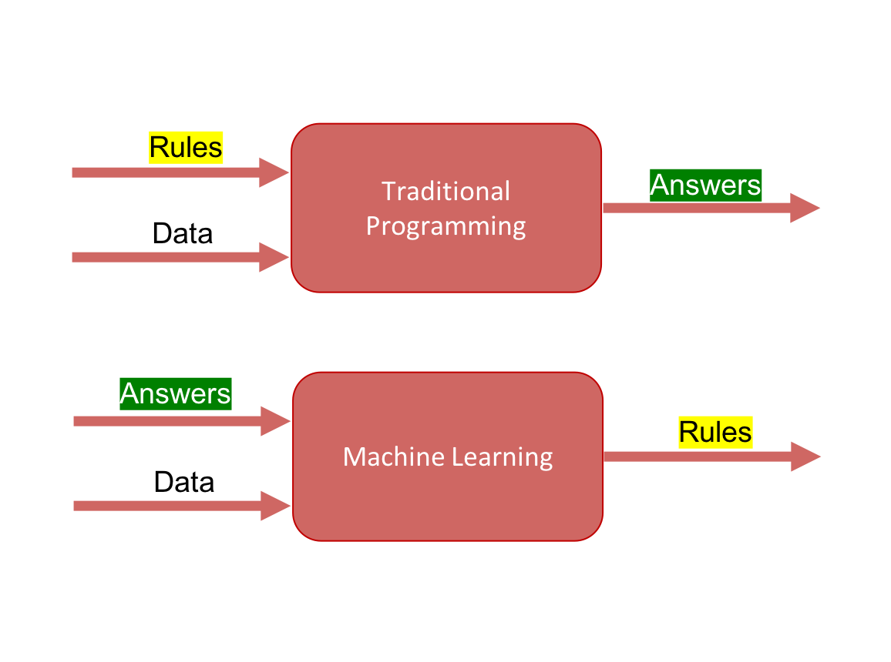

---

### 1997 - IBM Deep Blue

Traditional programming

---

---

### 2016 - Google DeepMind AlphaGo

Machine learning

---

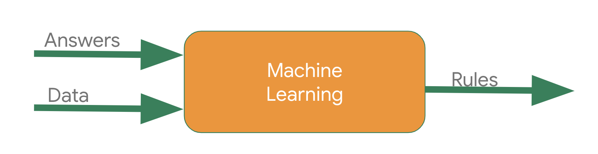

---

La différence en 20 ans ?

Big Data.

---

Comment ça marche ?

---

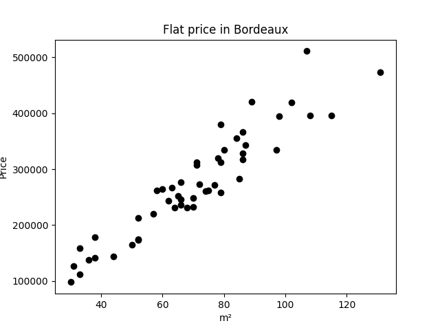

---
<!-- .slide: data-transition="fade" -->

---
<!-- .slide: data-transition="fade" -->

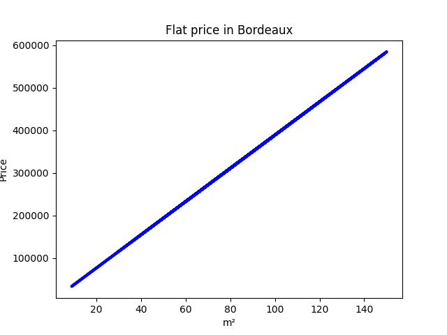

---

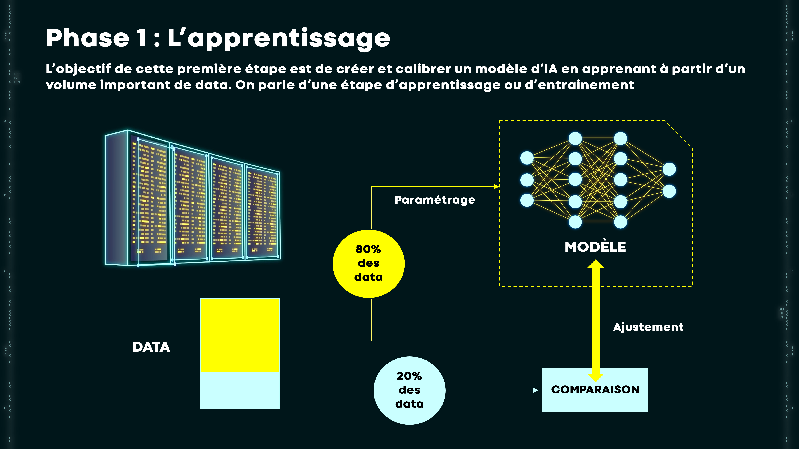

---

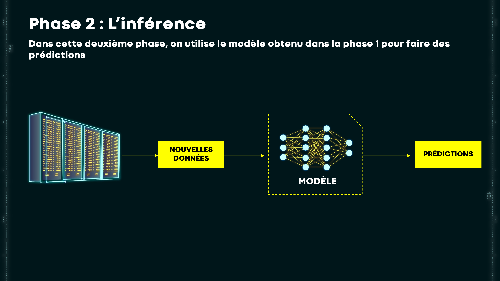

---

Clustering

---
<!-- .slide: data-transition="fade" -->

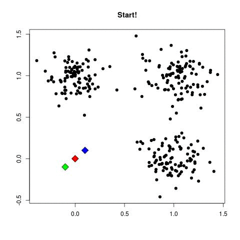

---
<!-- .slide: data-transition="fade" -->

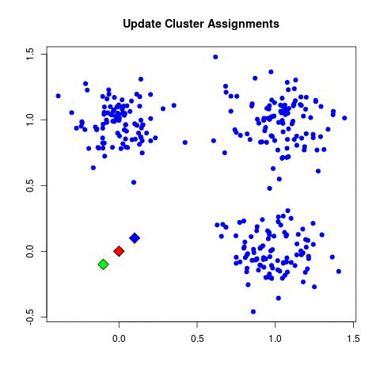

---
<!-- .slide: data-transition="fade" -->

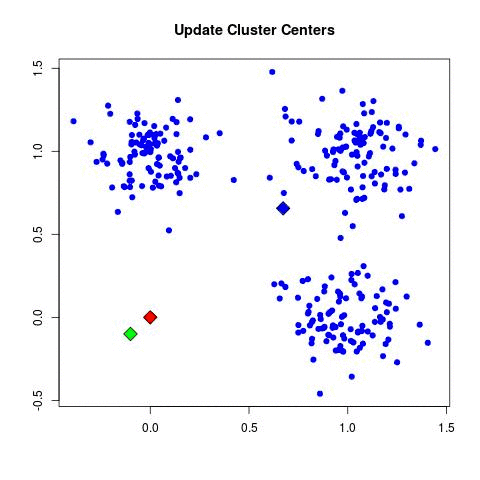

---
<!-- .slide: data-transition="fade" -->

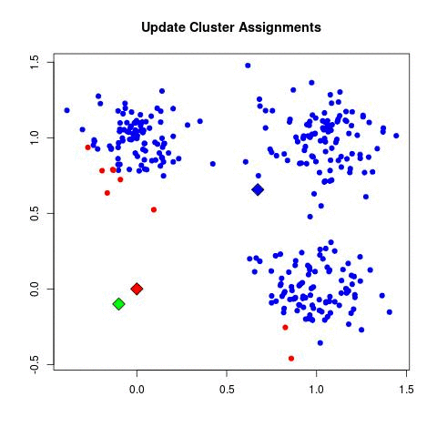

---
<!-- .slide: data-transition="fade" -->

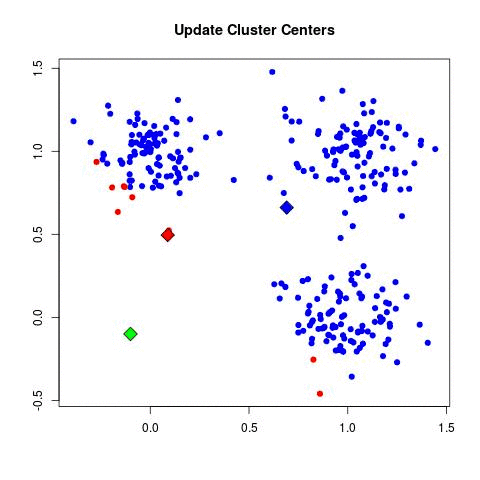

---
<!-- .slide: data-transition="fade" -->

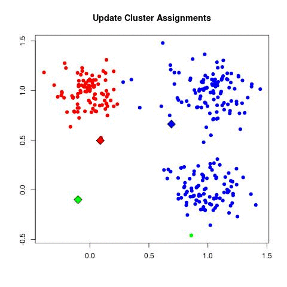

---
<!-- .slide: data-transition="fade" -->

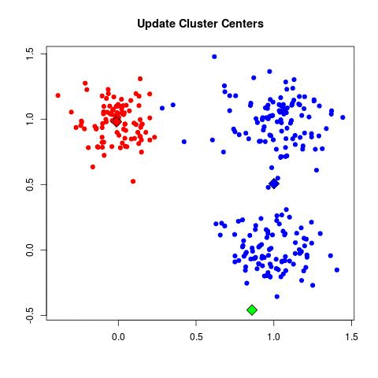

---
<!-- .slide: data-transition="fade" -->

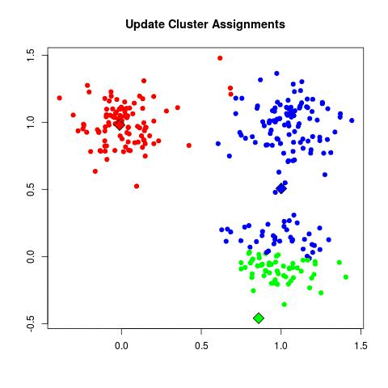

---
<!-- .slide: data-transition="fade" -->

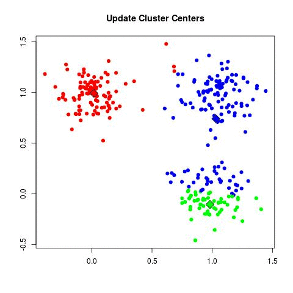

---
<!-- .slide: data-transition="fade" -->

---
<!-- .slide: data-transition="fade" -->

---
<!-- .slide: data-transition="fade" -->

---
<!-- .slide: data-transition="fade" -->

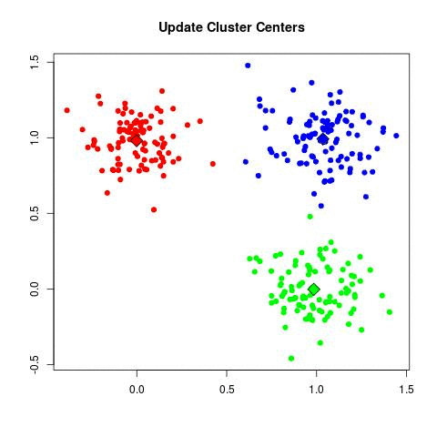

---
<!-- .slide: data-transition="fade" -->

---

Classification

---
<!-- .slide: data-transition="fade" -->

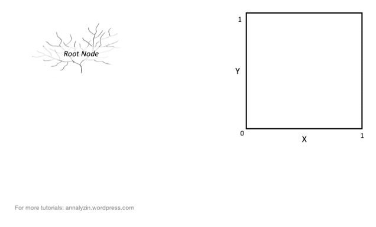

---
<!-- .slide: data-transition="fade" -->

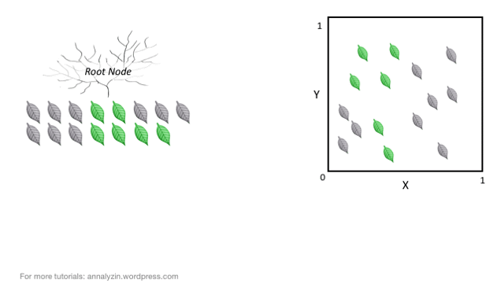

---
<!-- .slide: data-transition="fade" -->

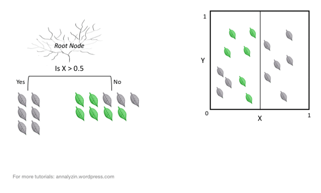

---
<!-- .slide: data-transition="fade" -->

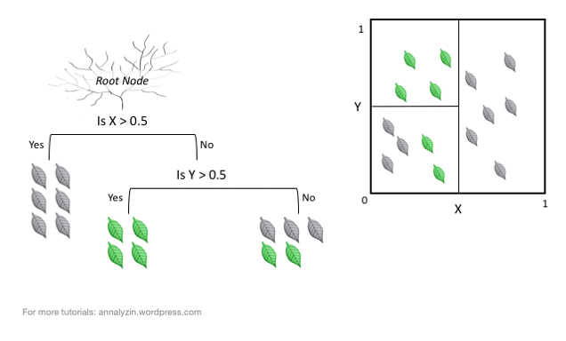

---
<!-- .slide: data-transition="fade" -->

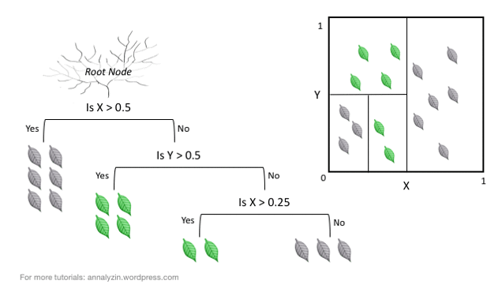

---

Recommendation

---

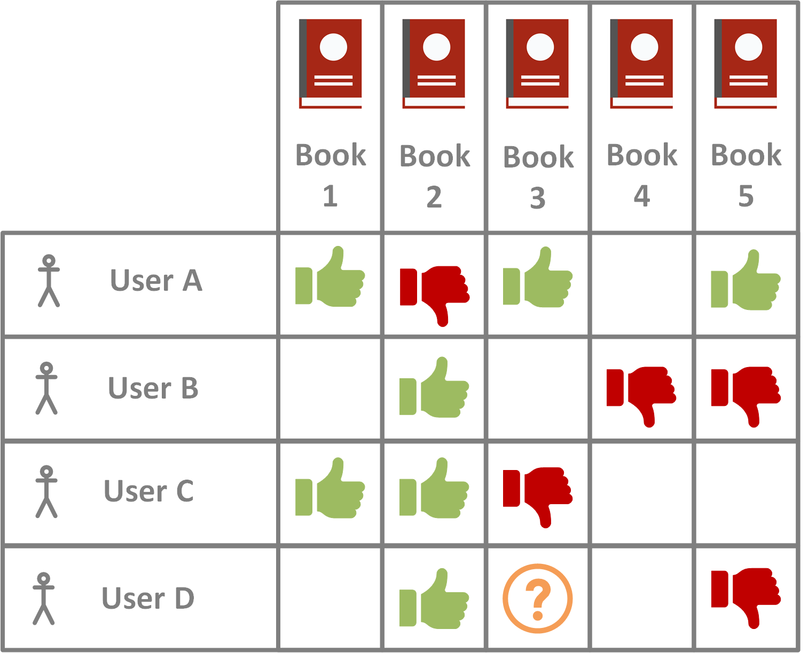

----

Target detecte une femme enceinte via recommandation de produit

[[Source](https://www.forbes.com/sites/kashmirhill/2012/02/16/how-target-figured-out-a-teen-girl-was-pregnant-before-her-father-did/)]

---

Deep learning (yolov3)

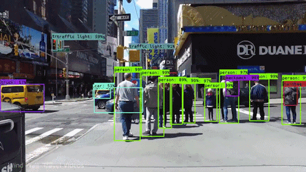

---

Problème d'explicativité

---

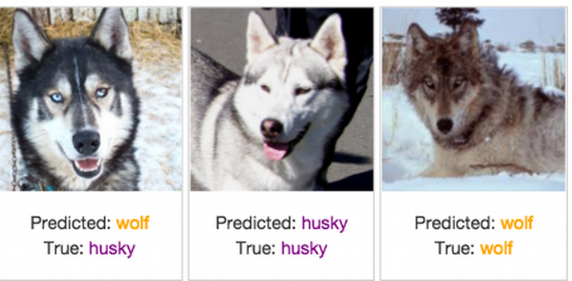

---

---

Identifier les thèmes éthiques.

----

- le 07 qui t'empeche d'avoir un credit

----

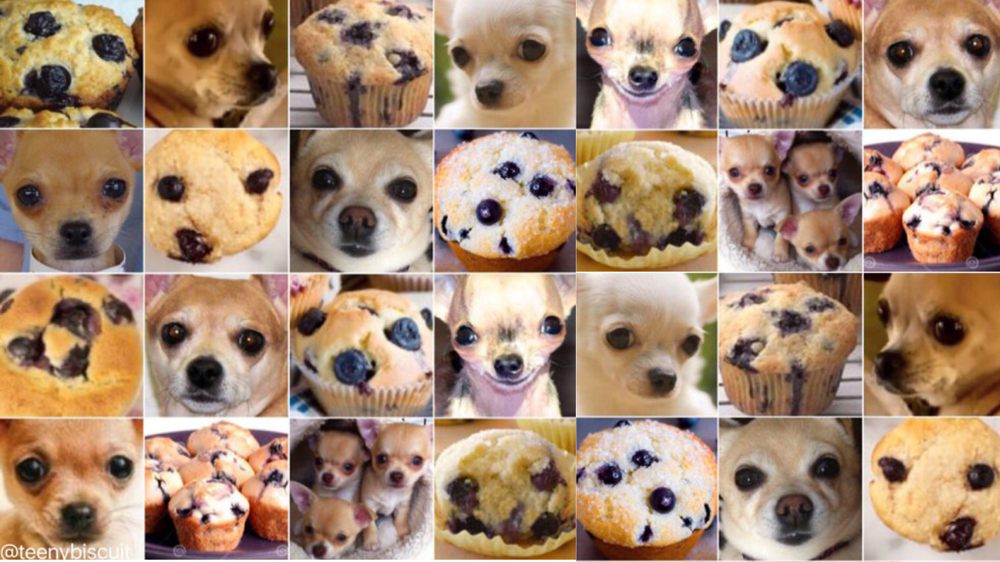

----

- Biais de données 
- Biais de représentation 
- Biais de confirmation 
- Biais de sélection d'échantillon
- Biais d'étiquetage
- Biais cognitif
- Biais socioculturels
- Biais de classe
- Biais de rétroaction en boucle