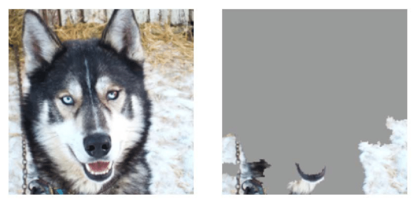

IA & Ethics  
2023-10-12  
Kedge Business School  
thomas.lentali@gmail.com  

---

Smartphone ?

Image detection.

---

Netflix, Amazon Prime, Disney+, CBO, Spotify, Deezer?

Recommendation.

---

Amazon, Cdiscount, Betclic?

Personnalisation.

---

Google, Bing, Qwant, DuckDuckGo, Facebook, Insta, Uber, deliveroo?

Classifiaction, clustering.

---

ChatGPT ?

Natural langage processing.

---

Tu utilises de l'IA.

---

Tu es utilisé pour renforcer ces IA.

---

---

### 1997 - IBM Deep Blue

Traditional computing

---

---

### 2016 - Google DeepMind AlphaGo

Machine learning

---

---

Comment ca marche ?

---

modelisation

---

---

---

---

clustering

---

---

prediction du futur

---

classification

---

recommendation

---

natural langage processing (google trad, ChatGPT)

---

image detection (yolov3)

---

Ethique

---

---

Un loup est un chien dans la neige.

---

- detection de femme enceinte via recommandation de produit
- le 07 qui t'empeche d'avoir un credit
- le chatbot de Microsoft est raciste