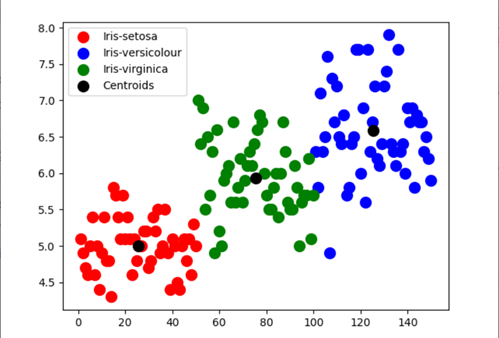
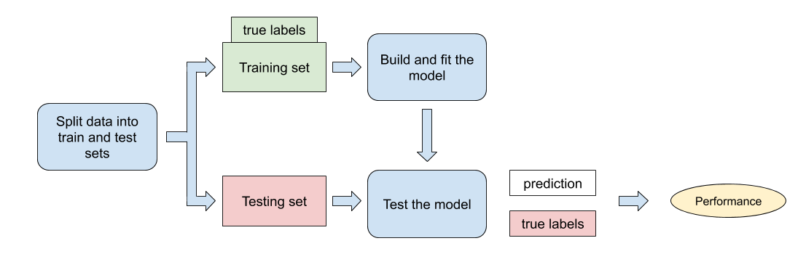

IA & Ethics  
2023-10-17  
Kedge Business School  
thomas.lentali@gmail.com  

---
<!-- .slide: data-transition="fade" -->

93% Python  
<p class="fragment" data-fragment-index="1">57% SQL</p>
<p class="fragment" data-fragment-index="2">41%  R</p>

----

[[Source](https://businessoverbroadway.com/2020/06/29/usage-of-programming-languages-by-data-scientists-python-grows-while-r-weakens/)]

---
<!-- .slide: data-transition="zoom" -->

```python
num = int(input("Enter a number: "))
if (num % 2) == 0:
   print(f"{num} is Even"))
else:
   print(f"{num} is Odd")
```

```text
Enter a number: 43
43 is Odd
```

---
<!-- .slide: data-transition="fade" -->

### ✨Open Source✨

[Pandas](https://github.com/pandas-dev/pandas), [Numpy](https://github.com/numpy/numpy), [Scipy](https://github.com/scipy/scipy), [Statmodels](https://github.com/statsmodels/statsmodels), [Matplotlib](https://github.com/matplotlib/matplotlib), [Plotly](https://github.com/plotly), [NetworkX](https://github.com/networkx/networkx), [Nltk](https://github.com/nltk/nltk), [PySpark](https://github.com/apache/spark/tree/master/python/pyspark), [Pytest](https://github.com/pytest-dev/pytest), [Request](https://github.com/request/request), [SqlAlchemy](https://github.com/sqlalchemy/sqlalchemy), [Sqlite](https://github.com/sqlite/sqlite), [Tensorflow](https://github.com/tensorflow/tensorflow), [Pytorch](https://github.com/pytorch/pytorch), [Airflow](https://github.com/apache/airflow), [Luigi](https://github.com/spotify/luigi), [Poetry](https://github.com/python-poetry/poetry)... 

---
<!-- .slide: data-transition="zoom" -->

**Python Machine Learning tool :**  
[**Scikit Learn**](https://github.com/scikit-learn/scikit-learn)

<p class="fragment" data-fragment-index="1">Since 2011</p>
<p class="fragment" data-fragment-index="2">30 536 commits</p>
<p class="fragment" data-fragment-index="3">2 740 contributors</p>

---

```python
from sklearn.datasets import load_iris
from sklearn import tree

iris = load_iris()
X, y = iris.data, iris.target
clf = tree.DecisionTreeClassifier()
clf = clf.fit(X, y)
```


---

```python
from sklearn.datasets import load_iris
from sklearn.cluster import KMeans

iris = load_iris()
X = iris.data
kmeans_model = KMeans(n_clusters=3)
clusters = kmeans_model.fit_predict(X)
```




---

#### From development to production



</br>


----

- Development 💻
- Staging 🖥️
- Production ☁️
